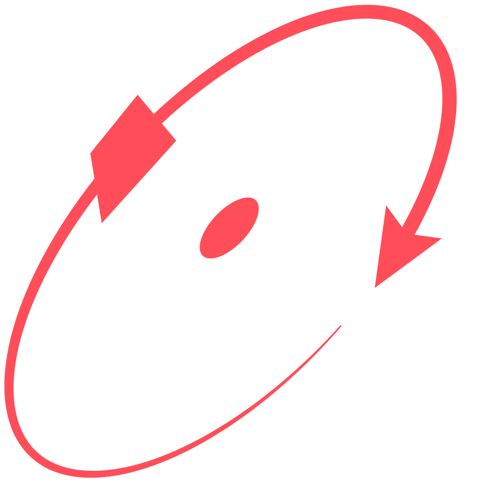

<h3 align="center" >
  <div>
    <a href="https://github.com/nickesc/steploop"></a>
    <a href="https://github.com/nickesc/steploop/actions/workflows/node.js.yml"></a>
    <br>
    <a href="https://www.npmjs.com/package/steploop"></a>
  </div>
  <br>
  
  <h3 align="center">
    <code>steploop</code>
  </h3>
  <h5 align="center">
    
  </h5>
  <h6 align="center">
    by <a href="https://nickesc.github.io">N. Escobar</a> / <a href="https://github.com/nickesc">nickesc</a>
  </h6>
  <h6 align="center">
    a fully-featured main-loop written in TypeScript
  </h6>
</h3>

<br>

## About `steploop`

`steploop` is a fully-featured main-loop written in TypeScript (and JS) with no additional dependencies. `steploop` provides a strong base to build a loop that runs once-per-frame. Inspired by game engine main-loops like Godot's [MainLoop](https://docs.godotengine.org/en/stable/classes/class_mainloop.html) or Unity's [Update() loop](https://docs.unity3d.com/Manual/execution-order.html).

> // TODO

### Install

Install `steploop` via NPM:

```sh
$ npm i steploop  ## not published yet
```

### Basic Usage

##### Import:

Import the library in your code:

```js
import { StepLoop } from "steploop";
```
> `steploop` must be imported as an ES6 module.

##### Usage:
> // TODO

## Documentation

> // TODO

## License

`steploop` is released under the **MIT** license. For more information, see the repository's [LICENSE](/LICENSE) file.
